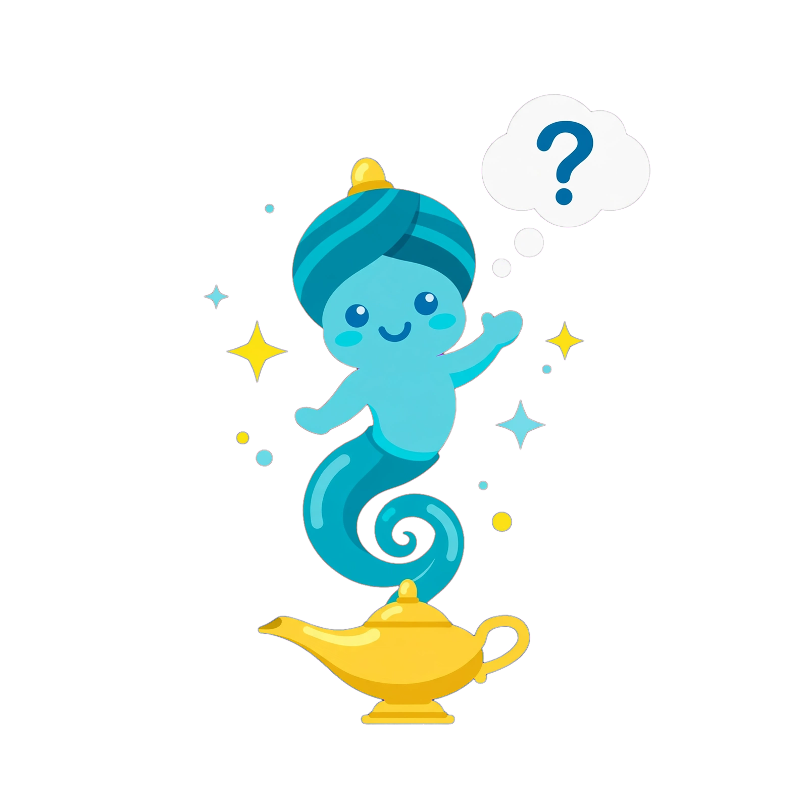

<p align="center">
  
</p>

<h1 align="center">Genie</h1>

<p align="center">
  Un Akinator hecho con IA. Piensa en algo, no me lo digas, y yo lo adivino.
</p>

<p align="center">
  <a href="https://github.com/lecodev-26/genie/releases/latest"></a>
  <a href="LICENSE"></a>
</p>

---

## Qué es

Genie es un archivo de texto (`SKILL.md`) con instrucciones para que una IA juegue contigo a adivinar lo que piensas. No hay app, ni código, ni nada que instalar.

Tú piensas en cualquier cosa: un personaje, un animal, una peli, un objeto, un lugar. La IA te va haciendo preguntas y, cuando tiene claro lo que es, suelta su apuesta.

## Cómo jugar

1. **Descarga el archivo:** [SKILL.md](https://github.com/lecodev-26/genie/releases/latest/download/SKILL.md)
2. **Pásaselo a tu IA.** Adjúntalo a la conversación o copia y pega su contenido.
3. **Escribe:** `Activar Skill`
4. **Piensa en algo** y, cuando estés listo, dile `listo`.
5. **Responde** con sí, no o no sé.

Eso es todo.

## Qué tiene de especial

- **Las preguntas se adaptan a lo que respondes.** No sigue un cuestionario fijo.
- **Entiende la duda.** Un "no sé" no lo toma como sí ni como no, y con un "quizás" o un "probablemente" lo trata como una pista débil.
- **No adivina por lucirse.** Solo lo intenta cuando tiene evidencia suficiente.
- **Si te equivocas o cambias una respuesta,** se ajusta sin discutir.
- **Cuenta las preguntas** y, al terminar, te ofrece otra partida.

## Comandos durante la partida

| Escribe | Qué pasa |
| --- | --- |
| `reiniciar` | Empieza una partida nueva desde cero |
| `parar` | Termina la partida |

## Compatibilidad

Está escrito como skill de Claude, pero en el fondo son instrucciones en texto, así que también se puede usar con ChatGPT, Gemini u otras IAs. Cada una lo sigue con más o menos fidelidad; si alguna no lo hace bien, prueba con otra.

## Estructura del repositorio

```
.
│   └── skills/genie/SKILL.md         # la skill (lo importante)
├── assets/icon.png                   # logo
├── LICENSE
└── README.md
```

## El reto

¿Has conseguido que no lo adivine? Abre un [issue](https://github.com/lecodev-26/genie/issues) y cuéntame qué pensaste. Quiero saber qué se te ocurrió.

## Licencia

[MIT](LICENSE). Úsalo, cámbialo y compártelo como quieras.

---

<p align="center">Hecho por <a href="https://github.com/lecodev-26">@lecodev-26</a></p>
